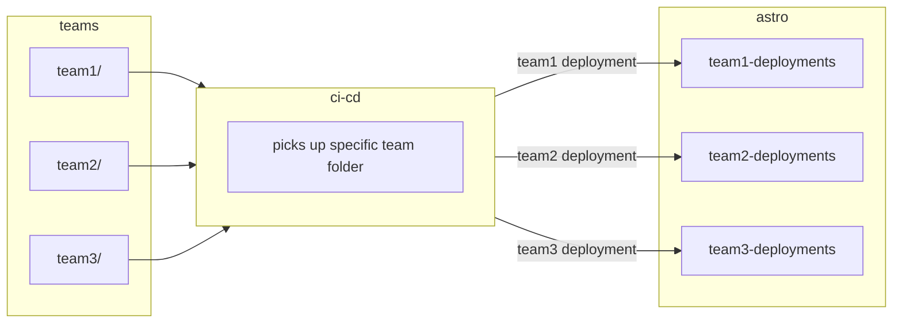

# rafa-astro-repo-example-two
This is a mono repo for multiple Astro deployments

# CI/CD process

```mermaid
graph LR;
    subgraph teams
        team1/
        team2/
        team3/
    end
    subgraph ci-cd
        dir[picks up specific team folder]
    end
    subgraph astro
        team1-deployments
        team2-deployments
        team3-deployments
    end
    
    team1/-->ci-cd;
    team2/-->ci-cd;
    team3/-->ci-cd;
    ci-cd-- team1 deployment -->team1-deployments;
    ci-cd-- team2 deployment -->team2-deployments;
    ci-cd-- team3 deployment -->team3-deployments;
```