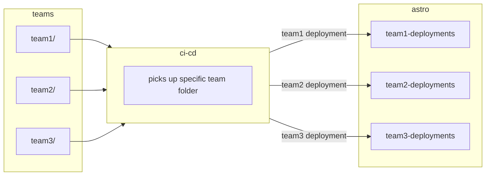

# rafa-astro-repo-example-two
This is a mono repo for multiple Astro deployments with multiple Teams. 
The teams are `alpha, cortex, kaizen` and each team deploys to their own set of
Astro deployments.

# Repo contents
```shell
.
├── README.md
├── team_alpha
│   ├── Dockerfile
│   ├── README.md
│   ├── airflow_settings.yaml
│   ├── dags
│   │   ├── example_dag_advanced.py
│   │   └── example_dag_basic.py
│   ├── include
│   ├── packages.txt
│   ├── plugins
│   ├── requirements.txt
│   └── tests
│       └── dags
│           └── test_dag_integrity.py
├── team_cortex
│   ├── Dockerfile
│   ├── README.md
│   ├── airflow_settings.yaml
│   ├── dags
│   │   ├── example_dag_advanced.py
│   │   └── example_dag_basic.py
│   ├── include
│   ├── packages.txt
│   ├── plugins
│   ├── requirements.txt
│   └── tests
│       └── dags
│           └── test_dag_integrity.py
└── team_kaizen
    ├── Dockerfile
    ├── README.md
    ├── airflow_settings.yaml
    ├── dags
    │   ├── example_dag_advanced.py
    │   └── example_dag_basic.py
    ├── include
    ├── packages.txt
    ├── plugins
    ├── requirements.txt
    └── tests
        └── dags
            └── test_dag_integrity.py
```

# CI/CD process

